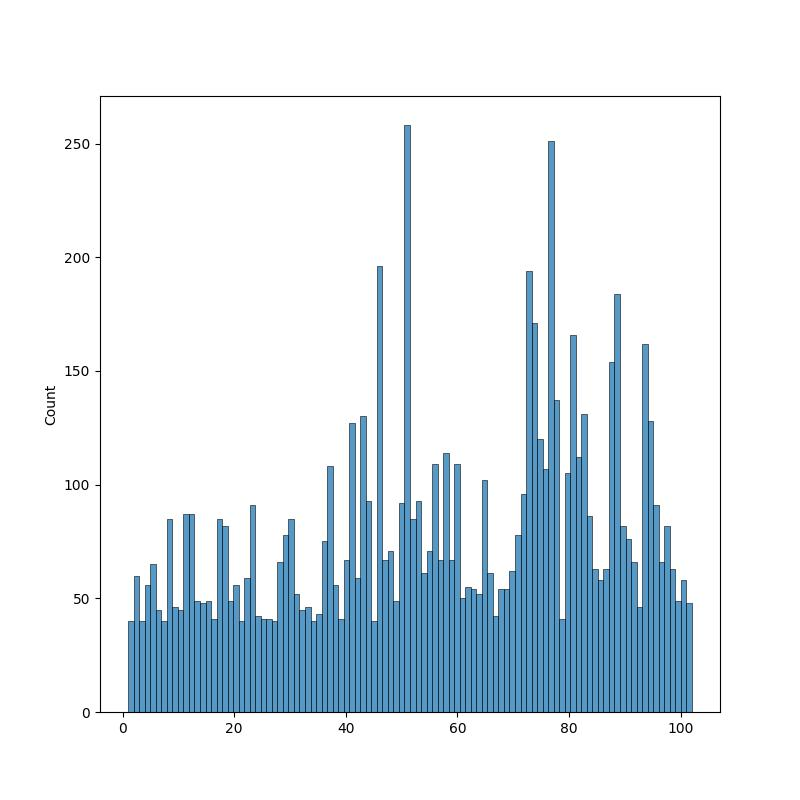

# Flower Classification
## About the dataset
We have created a 102 category dataset, consisting of 102 flower categories. The flowers chosen to be flower commonly occuring in the United Kingdom. Each class consists of between 40 and 258 images. 
We have a dataset of 102 classes of flowers that are commonly found in the United Kingdom. Each class consists of between 40 and 258 images (total number of samples is 8189). Table1 shows, number of sample for each class. 

| Label | Name                      | Count |     | Label | Name                | Count |
| ----- | ------------------------- | ----- | --- | ----- | ------------------- | ----- |
| 0     | pink primrose             | 85    |     | 51    | wild pansy          | 85    |
| 1     | hard-leaved pocket orchid | 93    |     | 52    | primula             | 93    |
| 2     | canterbury bells          | 61    |     | 53    | sunflower           | 61    |
| 3     | sweet pea                 | 71    |     | 54    | pelargonium         | 71    |
| 4     | english marigold          | 109   |     | 55    | bishop of llandaff  | 109   |
| 5     | tiger lily                | 67    |     | 56    | gaura               | 67    |
| 6     | moon orchid               | 114   |     | 57    | geranium            | 114   |
| 7     | bird of paradise          | 67    |     | 58    | orange dahlia       | 67    |
| 8     | monkshood                 | 109   |     | 59    | pink-yellow dahlia? | 109   |
| 9     | globe thistle             | 50    |     | 60    | cautleya spicata    | 50    |
| 10    | snapdragon                | 55    |     | 61    | japanese anemone    | 55    |
| 11    | colt's foot               | 54    |     | 62    | black-eyed susan    | 54    |
| 12    | king protea               | 52    |     | 63    | silverbush          | 52    |
| 13    | spear thistle             | 102   |     | 64    | californian poppy   | 102   |
| 14    | yellow iris               | 61    |     | 65    | osteospermum        | 61    |
| 15    | globe-flower              | 42    |     | 66    | spring crocus       | 42    |
| 16    | purple coneflower         | 54    |     | 67    | bearded iris        | 54    |
| 17    | peruvian lily             | 54    |     | 68    | windflower          | 54    |
| 18    | balloon flower            | 62    |     | 69    | tree poppy          | 62    |
| 19    | giant white arum lily     | 78    |     | 70    | gazania             | 78    |
| 20    | fire lily                 | 96    |     | 71    | azalea              | 96    |
| 21    | pincushion flower         | 194   |     | 72    | water lily          | 194   |
| 22    | fritillary                | 171   |     | 73    | rose                | 171   |
| 23    | red ginger                | 120   |     | 74    | thorn apple         | 120   |
| 24    | grape hyacinth            | 107   |     | 75    | morning glory       | 107   |
| 25    | corn poppy                | 251   |     | 76    | passion flower      | 251   |
| 26    | prince of wales feathers  | 137   |     | 77    | lotus               | 137   |
| 27    | stemless gentian          | 41    |     | 78    | toad lily           | 41    |
| 28    | artichoke                 | 105   |     | 79    | anthurium           | 105   |
| 29    | sweet william             | 166   |     | 80    | frangipani          | 166   |
| 30    | carnation                 | 112   |     | 81    | clematis            | 112   |
| 31    | garden phlox              | 131   |     | 82    | hibiscus            | 131   |
| 32    | love in the mist          | 86    |     | 83    | columbine           | 86    |
| 33    | mexican aster             | 63    |     | 84    | desert-rose         | 63    |
| 34    | alpine sea holly          | 58    |     | 85    | tree mallow         | 58    |
| 35    | ruby-lipped cattleya      | 63    |     | 86    | magnolia            | 63    |
| 36    | cape flower               | 154   |     | 87    | cyclamen            | 154   |
| 37    | great masterwort          | 184   |     | 88    | watercress          | 184   |
| 38    | siam tulip                | 82    |     | 89    | canna lily          | 82    |
| 39    | lenten rose               | 76    |     | 90    | hippeastrum         | 76    |
| 40    | barbeton daisy            | 66    |     | 91    | bee balm            | 66    |
| 41    | daffodil                  | 46    |     | 92    | ball moss           | 46    |
| 42    | sword lily                | 162   |     | 93    | foxglove            | 162   |
| 43    | poinsettia                | 128   |     | 94    | bougainvillea       | 128   |
| 44    | bolero deep blue          | 91    |     | 95    | camellia            | 91    |
| 45    | wallflower                | 66    |     | 96    | mallow              | 66    |
| 46    | marigold                  | 82    |     | 97    | mexican petunia     | 82    |
| 47    | buttercup                 | 63    |     | 98    | bromelia            | 63    |
| 48    | oxeye daisy               | 49    |     | 99    | blanket flower      | 49    |
| 49    | common dandelion          | 58    |     | 100   | trumpet creeper     | 58    |
| 50    | petunia                   | 48    |     | 101   | blackberry lily     | 48    |

*Table1: This table shows the number of samples for each class*

According to the distribution at *figure1*, it is clear that classes have imbalanced samples which has been a challenge to work with this dataset.

*Figure1: This plot shows the distribution of samples for each class*

*Figure2: Shows one sample from each category from the dataset*

Dataset can be downloaded from [this website](https://www.robots.ox.ac.uk/~vgg/data/flowers/102/)

## Final result

| Label | Name                      | Precision | Recall | F1-score | support |
| ----- | ------------------------- | --------- | ------ | -------- | ------- |
| 0     | pink primrose             | 0.89      | 1.00   | 0.94     | 8       |
| 1     | hard-leaved pocket orchid | 1.00      | 1.00   | 1.00     | 12      |
| 2     | canterbury bells          | 1.00      | 0.88   | 0.93     | 8       |
| 3     | sweet pea                 | 0.75      | 0.82   | 0.78     | 11      |
| 4     | english marigold          | 1.00      | 0.92   | 0.96     | 13      |
| 5     | tiger lily                | 1.00      | 1.00   | 1.00     | 9       |
| 6     | moon orchid               | 1.00      | 1.00   | 1.00     | 8       |
| 7     | bird of paradise          | 1.00      | 1.00   | 1.00     | 17      |
| 8     | monkshood                 | 0.82      | 1.00   | 0.90     | 9       |
| 9     | globe thistle             | 1.00      | 1.00   | 1.00     | 9       |
| 10    | snapdragon                | 1.00      | 0.94   | 0.97     | 17      |
| 11    | colt's foot               | 1.00      | 1.00   | 1.00     | 17      |
| 12    | king protea               | 1.00      | 1.00   | 1.00     | 9       |
| 13    | spear thistle             | 1.00      | 1.00   | 1.00     | 9       |
| 14    | yellow iris               | 1.00      | 1.00   | 1.00     | 9       |
| 15    | globe-flower              | 0.89      | 1.00   | 0.94     | 8       |
| 16    | purple coneflower         | 1.00      | 1.00   | 1.00     | 17      |
| 17    | peruvian lily             | 0.94      | 0.94   | 0.94     | 16      |
| 18    | balloon flower            | 1.00      | 1.00   | 1.00     | 9       |
| 19    | giant white arum lily     | 0.92      | 1.00   | 0.96     | 11      |
| 20    | fire lily                 | 1.00      | 1.00   | 1.00     | 8       |
| 21    | pincushion flower         | 1.00      | 0.91   | 0.95     | 11      |
| 22    | fritillary                | 1.00      | 1.00   | 1.00     | 18      |
| 23    | red ginger                | 1.00      | 1.00   | 1.00     | 8       |
| 24    | grape hyacinth            | 1.00      | 0.88   | 0.93     | 8       |
| 25    | corn poppy                | 1.00      | 0.88   | 0.93     | 8       |
| 26    | prince of wales feathers  | 1.00      | 1.00   | 1.00     | 8       |
| 27    | stemless gentian          | 0.93      | 1.00   | 0.96     | 13      |
| 28    | artichoke                 | 1.00      | 1.00   | 1.00     | 15      |
| 29    | sweet william             | 1.00      | 0.88   | 0.94     | 17      |
| 30    | carnation                 | 1.00      | 0.80   | 0.89     | 10      |
| 31    | garden phlox              | 1.00      | 0.89   | 0.94     | 9       |
| 32    | love in the mist          | 1.00      | 1.00   | 1.00     | 9       |
| 33    | mexican aster             | 1.00      | 1.00   | 1.00     | 8       |
| 34    | alpine sea holly          | 1.00      | 1.00   | 1.00     | 8       |
| 35    | ruby-lipped cattleya      | 1.00      | 0.93   | 0.97     | 15      |
| 36    | cape flower               | 1.00      | 0.90   | 0.95     | 21      |
| 37    | great masterwort          | 1.00      | 1.00   | 1.00     | 11      |
| 38    | siam tulip                | 1.00      | 1.00   | 1.00     | 8       |
| 39    | lenten rose               | 0.93      | 1.00   | 0.96     | 13      |
| 40    | barbeton daisy            | 0.96      | 1.00   | 0.98     | 25      |
| 41    | daffodil                  | 1.00      | 1.00   | 1.00     | 11      |
| 42    | sword lily                | 0.86      | 0.96   | 0.91     | 26      |
| 43    | poinsettia                | 1.00      | 1.00   | 1.00     | 18      |
| 44    | bolero deep blue          | 1.00      | 1.00   | 1.00     | 8       |
| 45    | wallflower                | 1.00      | 0.97   | 0.99     | 39      |
| 46    | marigold                  | 1.00      | 1.00   | 1.00     | 13      |
| 47    | buttercup                 | 1.00      | 0.93   | 0.96     | 14      |
| 48    | oxeye daisy               | 1.00      | 1.00   | 1.00     | 9       |
| 49    | common dandelion          | 1.00      | 1.00   | 1.00     | 18      |
| 50    | petunia                   | 0.96      | 0.90   | 0.93     | 51      |
| 51    | wild pansy                | 0.94      | 1.00   | 0.97     | 17      |
| 52    | primula                   | 1.00      | 0.94   | 0.97     | 18      |
| 53    | sunflower                 | 1.00      | 1.00   | 1.00     | 12      |
| 54    | pelargonium               | 0.93      | 1.00   | 0.97     | 14      |
| 55    | bishop of llandaff        | 1.00      | 1.00   | 1.00     | 21      |
| 56    | gaura                     | 1.00      | 1.00   | 1.00     | 13      |
| 57    | geranium                  | 1.00      | 1.00   | 1.00     | 22      |
| 58    | orange dahlia             | 1.00      | 1.00   | 1.00     | 13      |
| 59    | pink-yellow dahlia?       | 1.00      | 1.00   | 1.00     | 21      |
| 60    | cautleya spicata          | 1.00      | 1.00   | 1.00     | 10      |
| 61    | japanese anemone          | 0.92      | 1.00   | 0.96     | 11      |
| 62    | black-eyed susan          | 1.00      | 1.00   | 1.00     | 10      |
| 63    | silverbush                | 1.00      | 1.00   | 1.00     | 10      |
| 64    | californian poppy         | 1.00      | 1.00   | 1.00     | 20      |
| 65    | osteospermum              | 1.00      | 1.00   | 1.00     | 12      |
| 66    | spring crocus             | 1.00      | 1.00   | 1.00     | 8       |
| 67    | bearded iris              | 1.00      | 0.80   | 0.89     | 10      |
| 68    | windflower                | 1.00      | 0.90   | 0.95     | 10      |
| 69    | tree poppy                | 1.00      | 1.00   | 1.00     | 12      |
| 70    | gazania                   | 1.00      | 1.00   | 1.00     | 15      |
| 71    | azalea                    | 0.90      | 0.95   | 0.92     | 19      |
| 72    | water lily                | 1.00      | 1.00   | 1.00     | 38      |
| 73    | rose                      | 0.94      | 0.97   | 0.96     | 34      |
| 74    | thorn apple               | 0.96      | 1.00   | 0.98     | 24      |
| 75    | morning glory             | 1.00      | 0.95   | 0.98     | 21      |
| 76    | passion flower            | 1.00      | 1.00   | 1.00     | 50      |
| 77    | lotus                     | 1.00      | 0.96   | 0.98     | 27      |
| 78    | toad lily                 | 1.00      | 1.00   | 1.00     | 8       |
| 79    | anthurium                 | 0.95      | 1.00   | 0.98     | 21      |
| 80    | frangipani                | 1.00      | 1.00   | 1.00     | 33      |
| 81    | clematis                  | 0.96      | 1.00   | 0.98     | 22      |
| 82    | hibiscus                  | 0.96      | 0.92   | 0.94     | 26      |
| 83    | columbine                 | 0.94      | 0.88   | 0.91     | 17      |
| 84    | desert-rose               | 1.00      | 0.92   | 0.96     | 12      |
| 85    | tree mallow               | 0.85      | 1.00   | 0.92     | 11      |
| 86    | magnolia                  | 1.00      | 1.00   | 1.00     | 12      |
| 87    | cyclamen                  | 0.94      | 0.97   | 0.95     | 30      |
| 88    | watercress                | 0.97      | 0.94   | 0.96     | 36      |
| 89    | canna lily                | 1.00      | 0.88   | 0.93     | 16      |
| 90    | hippeastrum               | 1.00      | 1.00   | 1.00     | 15      |
| 91    | bee balm                  | 1.00      | 1.00   | 1.00     | 13      |
| 92    | ball moss                 | 1.00      | 0.89   | 0.94     | 9       |
| 93    | foxglove                  | 0.97      | 1.00   | 0.98     | 32      |
| 94    | bougainvillea             | 1.00      | 0.96   | 0.98     | 25      |
| 95    | camellia                  | 0.78      | 1.00   | 0.88     | 18      |
| 96    | mallow                    | 0.86      | 0.92   | 0.89     | 13      |
| 97    | mexican petunia           | 0.89      | 1.00   | 0.94     | 16      |
| 98    | bromelia                  | 1.00      | 1.00   | 1.00     | 12      |
| 99    | blanket flower            | 1.00      | 1.00   | 1.00     | 9       |
| 100   | trumpet creeper           | 0.92      | 1.00   | 0.96     | 11      |
| 101   | blackberry lily           | 1.00      | 1.00   | 1.00     | 9       |

*Table2: Final results from classification report*

## Preprocessing

Images are resized to have the shape of (224, 224, 3); this image size is almost compatible with all pretrained models and retains the quality. (Also resize method is *bilinear*)

The fact that we have a small dataset with imbalanced data, we should definitely consider augmentation. Augmentation parameters are listed below in order:

- Random contrast with lower and upper factor of 0.6 and 1.2 respectively
- Random horizontal flip
- Random brightness with **max_delta = 0.3**
- Random saturation with lower and upper factor of 0.6 and 1.2 respectively
- **Note that the image should be clipped so to have values from 0 to 255**
- Random rotation with the factor of 0.15
- Random translation with the factors of 0.15 and 0.15 for vertical and horizontal translation

*It has been seen that augmenting prior to resizing results in a better performance but slows the process of training (in our case, it slowed down the process x4 times using Nvidia RTX 2060 notebook)*

Since EfficientNetV2B0 is used as the base network, we also used its associate preprocessing input function; training and validation have:

- Training
  - MAX: 255.0 
  - MIN: 0.0 
  - MEAN: 94.13
  - STD: 64.27
- Validation
  - MAX: 255.0 
  - MIN: 0.0 
  - MEAN: 93.06 
  - STD: 70.38

Although the model it self has a preprocessing layer (Rescaling layer) that makes the input in the range of $[-1, 1]$

## Model
Given the small dataset, model is trained better with transfer learning. Trying different models, EfficientNetV2B0 has been the best model in both terms of running time and memory and accuracy. *Table2* shows layers and parameters for our model.

| Layer (Type)                                      | Output Shape          | Param #  |
| ------------------------------------------------- | --------------------- | -------- |
| input_2 (InputLayer)                              | [(None, 224, 224, 3)] | 0        |
| efficientnetv2-b0 (Functional)                    | (None, 7, 7, 1280)    | 5919312  |
| conv2d (Conv2D)                                   | (None, 7, 7, 1024)    | 11797504 |
| batch_normalization (BatchNormalization)          | (None, 7, 7, 1024)    | 4096     |
| activation (Activation)                           | (None, 7, 7, 1024)    | 0        |
| global_average_pooling2d (GlobalAveragePooling2D) | (None, 1024)          | 0        |
| dropout (Dropout)                                 | (None, 1024)          | 0        |
| dense (Dense)                                     | (None, 102)           | 104550   |

**Total params: 17,825,462 (68.00 MB)**\
**Trainable params: 16,390,802 (62.53 MB)**\
**Non-trainable params: 1,434,660 (5.47 MB)**

Given the fact that number of parameters for training is about $\approx 16M$, it is impossible to gain a good performance without having to deal with the problem of high variance (over fitting) unless we use a large dropout rate (**in our case we chose 0.75**). 

### Address the problem of imbalanced data
To address the problem of imbalanced data, we specified weights for each class (to be applied to the loss function). Weights are calculated with:
$$
\begin{equation}
    w_{i} = \frac{\sum_{j}c_j}{102 c_i }
\end{equation}
$$
Where $w_i$ denotes the weight for class $i$ and $c_i$ denotes the number of samples for class $i$.

### Model compile
One way to address the problem of imbalanced classses, is to use **Focal loss**. Focal loss applies a modulating term to the cross entropy loss in order to focus learning on hard misclassified examples. It is a dynamically scaled cross entropy loss, where the scaling factor decays to zero as confidence in the correct class increases. Focal loss reduces the contribution of easy examples to the loss function, thereby giving more importance to difficult examples. Helps in dealing with noisy data: In real-world scenarios, the training data may be noisy, which can lead to misclassification.

## Results
After fine-tuning (freezing up to 149 layers), we've got 

|              | precision | recall | f1-score | support |
| ------------ | --------- | ------ | -------- | ------- |
| accuracy     |           |        | 0.97     | 1602    |
| macro avg    | 0.97      | 0.97   | 0.97     | 1602    |
| weighted avg | 0.97      | 0.97   | 0.97     | 1602    |

*Table3: Classification report*

**Also result are illlustrated in *table2***

Model can be downloaded from [here](Notebooks/saves/tf/02_efficient_netB0_97.tf/)